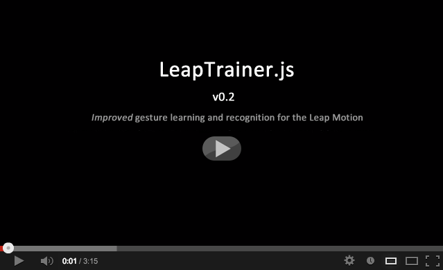
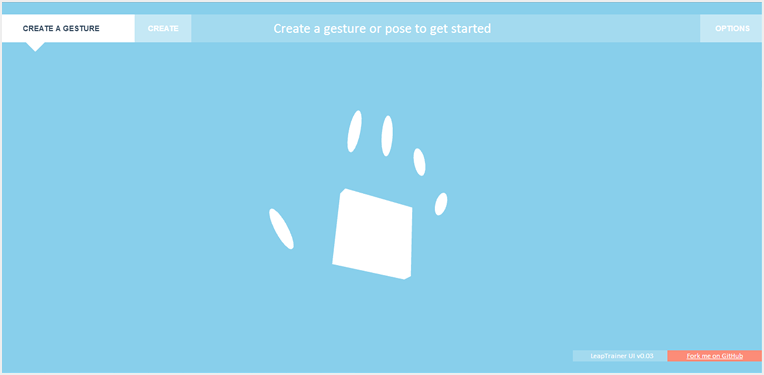
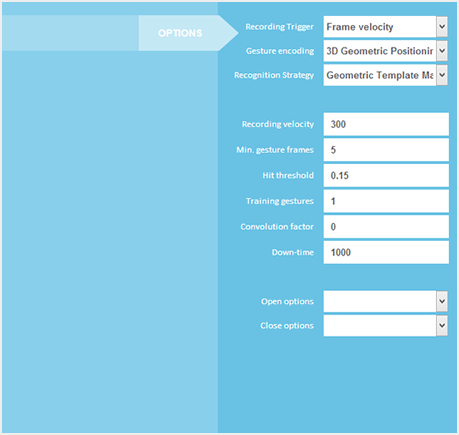
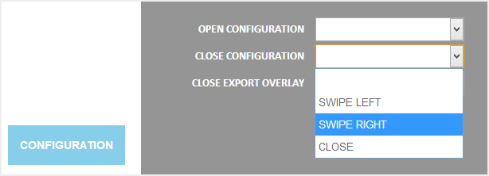
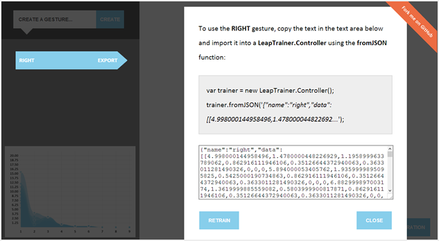

# LeapTrainer.js

A gesture learning and recognition framework for the [Leap Motion](http://www.leapmotion.com/).

Below is [a video of the LeapTrainer UI](http://www.youtube.com/watch?v=JVqalPM9pHs) learning and then recognizing some hand gestures.  

An online demo of the UI [can be found right here](https://rawgithub.com/roboleary/LeapTrainer.js/master/trainer-ui.html).

This framework currently supports high- and low- resolution gesture encoding and cross-correlation and neural network-based gesture recognition.  

It is intended that developers [use this framework to explore alternative and improved capture and recognition algorithms](#sub-classing-the-leaptrainercontroller).

All contributions are welcome - the best known implementation of each of the core framework functions will be used as the framework default.  Currently these are:

* Gesture recording triggered by frame velocity
* Low-resolution capture for simple gesture recording
* Algebraic cross-correlation for gesture recognition

## Usage

First, you'll need a [Leap Motion](http://www.leapmotion.com/) connected to the machine you're running your browser on.  The Leap monitors movement and transmits data to the browser via the [Leap Motion Javascript API](http://js.leapmotion.com/). 

This data is then analysed by the LeapTrainer framework and used to learn gestures and fire events when known gestures are detected.

To use the framework, include the [Leap Motion Javascript API](http://js.leapmotion.com/) and _leaptrainer.js_ in your HTML page:

	

	

Then create a LeapTrainer controller object:

	var trainer = new LeapTrainer.Controller();

This object will internally create a [LeapMotion.Controller](http://js.leapmotion.com/api/v0.2.0/docs#leap-controller) with which to communicate with the connected device. If you prefer to create your own Leap.Controller object, you can pass one as a parameter to the constructor - just make sure to call the _connect_ function once the trainer is created.

	var leapController = new Leap.Controller();

	var trainer = new LeapTrainer.Controller({controller: leapController});

	leapController.connect();

The LeapTrainer controller constructor also accepts [a set of configuration variables](#Options).  

For developers interested in developing new recording or recognition algorithms, [the LeapTrainer controller can be easily sub-classed](#Subclassing).

Once a LeapTrainer controller is created it can be used to [train new gestures](#Training), [receive events when known gestures are detected](#Listening), and [import and export gestures](#Import). 

## Training new gestures

A new gesture can be created like this:

	trainer.create('Halt');

By default, calling the _create_ function will switch the controller into _training mode_.  If a second parameter is passed this will cause the controller to just store the gesture name without moving directly into training.

	trainer.create('Halt', true); // The controller won't switch to training mode

While in _training mode_ LeapTrainer will watch for [a configured number of training gestures](#Options), and once enough input has been gathered _'Halt'_ will be added to the list of known gestures.  

If a learning algorithm is being used that requires an initialization period (for example, [neural network-based  recognition](#Subclassing)) then a [training completion event](#Events) will fire once the algorithm has been fully initialized.

The [LeapTrainer UI](#TrainerUI) can be used as an interface for training new gestures.

## Receiving events when gestures are detected

Once a gesture has been learned LeapTrainer will fire an event with the name of the gesture whenever it is detected again.  

Components can register to receive these events using the _on()_ function:

	trainer.on('Halt', function() { console.log('Stop right there!'); });

Previously registered listeners can unregister themselves using the _off()_ function:

	trainer.on('Halt', registeredFunction);

## Importing and exporting gestures

Gestures can be exported from LeapTrainer for persistence or transport using the _toJSON()_ function, which accepts a gesture name as a parameter:

	var savedGesture = trainer.toJSON('Halt');

Previously exported gestures can be imported into a LeapTrainer controller using the fromJSON() function:

	trainer.fromJSON(savedGesture);

Sub-classes of the controller may implement alternative export formats. By default the JSON exported just contains the name of the gesture and the stored training data - something like this:

	{"name":"Halt","data":[[1.940999984741211,8.213000297546387,...'}

Since the training data format may change between controller sub-classes, it is not necessarily true that gestures exported from one LeapTrainer Controller sub-class will be compatible with another.  For example, the [neural network controller](#Subclassing) adds an encoded trained neural network to the export format so that networks don't need to be re-trained on import.

## Options

Options can be passed to the LeapTrainer.Controller constructor like so:

	new LeapTrainer.Controller({minRecordingVelocity: 100, downtime: 100});

Some options apply to the default implementations of functions, and may be removed or redundant in sub-classes of the LeapTrainer controller. 

* **controller** : An instance of Leap.Controller class from the [Leap Motion Javascript API](http://js.leapmotion.com/).  This will be created with default settings if not passed as an option.

* **minRecordingVelocity**: The minimum velocity a frame needs to be measured at in order to trigger gesture recording.  Frames with a velocity below this speed will cause recording to stop. Frame velocity is measured as the fastest moving hand or finger tip in view (default: 400)

* **minGestureFrames**: The minimum number of frames that can contain a recognisable gesture (default: 5)

* **hitThreshold**: The return value of the recognition function above which a gesture is considered recognized. Raise this to make gesture recognition more strict (default: 0.6)

* **trainingGestures**: The number of training gestures required to be performed in training mode (default: 3)

* **convolutionFactor**: The factor by which training samples will be convolved over a gaussian distribution in order to expand the input training data. Set this to zero to disable convolution (default: 3)

* **downtime**: The number of milliseconds after a gesture is identified before another gesture recording cycle can begin. This is useful, for example, to avoid a _'Swipe Left'_ gesture firing when a user moves his or her hand quickly back to center directly afer performing a _'Swipe Right'_ (default: 200)

## Events

The LeapTrainer controller will emit events to [listening components](#Listening) during training and recognition.  

Apart from events for the names of recognized gestures, several events inform listeners about activity inside the framework.  These events may be parameterized to provide listeners with more data. 

Components can register to listen for framework events in the same way as they register to listen for gestures:

	trainer.on('training-started', function(gestureName) {
		
		console.log('Started training ' + gestureName);
	});

The framework events are:

* **gesture-created**: Fired when a new gesture is added to a LeapTrainer controller object - either by a call to the _create()_ function or by importing a saved gesture via the _fromJSON()_ function.  Carries two parameters: _gestureName_ and _trainingSkipped_. The latter will be true if this gesture was created by a call to the _create()_ function [in which the second parameter was _true_](#Training).

* **training-started**: Fired when training begins on a gesture - carries a single parameter, _gestureName_

* **training-complete**: Fired when training completes on a gesture - carries two parameters, _gestureName_ and _trainingGestures_.  The latter is the array of encoded gestures recorded during training.

* **training-gesture-saved**: Fired during training when a new training gesture is recorded - carries two parameters, _gestureName_ and _trainingGestures_.  The latter is the array of encoded gestures recorded _so far_ during training, the last entry of which will be the gesture just recorded.

* **gesture-detected**: Fired when any gesture is detected, regardless of whether it is recognized or not.  This event fires before recognition is attempted and carries two parameters, _gesture_ and _frameCount_.  The first is the recorded encoded gesture, the second is the number of frames in the gesture. 

* **gesture-recognized**: Fired when a known gesture is recognized - carries two parameters, _hit_ and _gestureName_. The _hit_ parameter is a value between 0.0 and 1.0 indicating how closely the recognized gesture was matched to the training data, with 1.0 being a 100% match.

* **gesture-unknown**: Fired when a gesture is detected that doesn't match any known gesture sufficiently to be considered a match.  This event carries two parameters, _bestHit_ and _closestGestureName_, identifying the closest known gesture.

## API

The LeapTrainer.Controller object offers the following functions, any or all of which can be overidden by sub-classes:

* **initialize(options)**: Called just after a new instance of the controller is created to parse the options array, connect to the Leap Motion device (unless an existing Leap.Controller object was passed as a parameter), and register a frame listener with the leap controller.

* **onFrame()**: Called as each frame arrives from the Leap Motion.  _Note:_ This function is actually defined in the _bindFrameListener_ function below.

* **bindFrameListener(options)**: Called by the _initialize_ function in order to create and bind the _onFrame_ function to Leap.Controller frame events.

* **recordableFrame(frame, min)**: Returns TRUE if the provided frame should trigger recording and FALSE if it should stop recording.  If the framework isn't already recording, returning FALSE does nothing, and vice versa.. So really it returns whether or not a frame may possibly be part of a gesture. By default this function makes its decision based on one or more hands or fingers in the frame moving faster than the configured _minRecordingVelocity_, which is provided as a second parameter.

* **recordFrame(frame, lastFrame, recordVector, recordValue)**: Called for each frame during gesture recording, and it is responsible for adding values in frames using the provided recordVector and recordValue functions (which accept a 3-value numeric array and a single numeric value respectively). This function should be overridden to modify the quality and quantity of data recorded for gesture recognition.

* **create(gestureName, skipTraining)**: Called to create a new gesture, and - normally - trigger training for that gesture. The parameter gesture name is added to the gestures array and unless the trainLater parameter is present, the startRecording function is triggered. This function fires the _'gesture-created'_ event.

* **startTraining(gestureName)**: Sets the object-level trainingGesture variable. This modifies what happens when a gesture is detected by determining whether we save it as a training gesture or attempting to recognize it. This function fires the _'training-started'_ event.

* **trainAlgorithm(gestureName, trainingGestures)**: For recognition algorithms that need a training operation after training data is gathered, but before the gesture can be recognized, this function can be implemented and will be called in the _'saveTrainingGesture'_ function below when training data has been collected for a new gesture.

* **saveTrainingGesture(gestureName, gesture)**: The saveTrainingGesture function records a single training gesture.  If the number of saved training gestures has reached _'trainingGestures'_, the training is complete and the system switches back out of training mode. This function fires the _'training-complete'_ and _'training-gesture-saved'_ events.

* **distribute(trainingGestures)**: Generates a normalized distribution of values around a set of recorded training gestures.  The objective of this function is to increase the size of the training data without actually requiring the user to perform more training gestures. The default implementation of this function generates a gaussian normalized distribution.

* **recognize(gesture)**: Matches a parameter gesture against the known set of saved gestures.  This function does not need to return any value, but it should fire either the _'gesture-recognized'_ or the _'gesture-unknown'_ event, providing a numeric value for the closest match and the name of the closest known gesture as parameters to the event. If a gesture is recognized, an event with the name of the gesture and no parameters will also be fired.

* **correlate(gestureName, trainingGestures, gesture)**: This function accepts a set of training gestures and a newly input gesture and produces a number between 0.0 and 1.0 describing how closely the input gesture resembles the set of training gestures. The default implementation uses a cross-correlation function (nicely described here http://paulbourke.net/miscellaneous/correlate/) to identify an average level of similarity between the input gesture and the whole set of training gestures.

* **getRecordingTriggerStrategy()**: This and the two functions below are used by the training UI to select alternative strategies - sub-classes should override these functions with names for the algorithms they implement. Each function should return a descriptive name of the strategy implemented. By defult this function returns _'Frame velocity'_.

* **getFrameRecordingStrategy()**: Returns the type and format of gesture data recorded by the recordFrame function. By default, _'Low-Resolution'_.

* **getRecognitionStrategy()**: Returns the name of the mechanism used to recognize learned gestures. By default, _'Cross-Correlation'_.

* **toJSON(gestureName)**: Converts the requested stored gesture into a JSON string containing the gesture name and training data. Gestures exported using this function can be re-imported using the fromJSON function below. This function depends on the browser providing the JSON object.

* **fromJSON(json)**: This is a simple import function for restoring gestures exported using the toJSON function above. Returns the object parsed out of the JSON, so that overriding implementations can make use of this function.

* **on(event, listener)**: This is a standard event registration event - paired with the fire event below, it provides an event-oriented mechanism for notifying external components when significant events happen - gestures being matching, training cycles starting and ending, etc.

* **off(event, listener)**: Removes an event listener previously bound using the on() function above.

* **fire(event)**: Called in various function above in order to notify listening components when the events they're registered to hear occur. This function accepts an arbitrary number of arguments, all of which will be passed on to listening functions except the first (so not quite arbitrary.. (arbitrary + 1)), which is the name of the event being fired.

* **pause()**: Temporarily disables frame monitoring.

* **resume()**: Resumes paused frame monitoring.

* **destroy()**: Unbinds the controller from the leap frame event cycle - making it inactive and ready for cleanup.

* **extend(overrides)**: Used to create sub-classes of the LeapTrainer controller - described below.

## Sub-classing the LeapTrainer.Controller

The default gesture recording and recognition functions are intended only as a starting point for investigation into better mechanisms for performing these functions.  

Consequently, a simple mechanism is provided for extending the LeapTrainer.Controller class and overriding the various functions described above. Sub-classes are created using the _extend_ function:

	LeapTrainer.SVMController = LeapTrainer.Controller.extend({

	    getRecognitionStrategy : function() { 

	        return 'Support Vector Machines'; 
	    },

	    trainAlgorithm: function (gestureName, trainingGestures) { 

	        ...train an SVM... 
	    },

	    correlate: function(gestureName, trainingGestures, gesture) { 

	        ..perform SVM pattern recognition... 
	    }
	});

Sub-classes of the default LeapTrainer.Controller can be found in the /sub-classes/ folder of the project.  Currently, two exist:

* **High-Resolution recorder**: Records much more data per frame - increases the accuracy of recorded gestures, but makes recognition that much more difficult.

* **Neural network recognition** Implements artificial neural network-based gesture recognition. 

Sub-classes can be integrated into the LeapTrainer UI for testing and experimentation [as described below](#TestingSubclasses).

## The LeapTrainer UI

Not every application will need to implement training of new gestures - so a LeapTrainer UI has been created for training and exporting gestures. An online demo of the UI [can be found here](https://rawgithub.com/roboleary/LeapTrainer.js/master/trainer-ui.html).

This interface is also useful for experimentation with alternative algorithms for training and recognition, and for getting general feedback on what's happening 
inside the framework at runtime.

This application is just a simple HTML page and a javascript file - both of which are included in the project - so it's also useful as an example of how to integrate the framework into an HTML interface.

The UI allows configuration variables in the controller to be set:

Handlers on each of the configuration inputs immediately set the associated configuration variable as soon a _blur_ event fires against them.

Setting the _recording trigger_, _gesture encoding_, or _recognition strategy_ variables will copy the associated functions out of the controller sub-classes that implement them into the active controller.  

Testing new controller implementations is as simple as modifying the training HTML page to include the implementation:

	

If an included javascript contains a sub-class of the LeapTrainer.Controller object, the UI will pick it up automatically and allow it to be selected as the active controller.  In this way new implementations can be easily tested by just including them in the training UI HTML page.

The configuration open and close functions, as well as the function used to close overlays can be bound to learned gestures as an example of controlling an interface with gesture input. 

Finally, trained gestures can be exported from the UI by clicking on them in the list of known gestures and copying the resulting JSON into the target application:

The training UI code is fully commented and can be used as is or modified in other applications (within the bounds of the [MIT license](http://en.wikipedia.org/wiki/MIT_License)).

## But it doesn't recognize my gang sign / secret handshake / [full double-rimmer salute](http://www.youtube.com/watch?v=aXdtUISSHuo)

Well, maybe not yet - we're just at version 0.1.  There are some [alternative capture and recognition functions](#Subclassing) already included, as well as a variety of [configuration options](#Options) so maybe selecting the right implementation and tuning the framework will yield better results for the kinds of gestures you need.

With more experimentation and with contributions from the Leap developers community, the training and recognition functions should improve over time. So if you're not getting the results you need now, check back in a while and see how we're doing.

Alternatively, if you've got ideas how the framework might be improved - or if you just want to experiment with gesture training and recognition algorithms - you could take a look at [creating a sub-class of the LeapTrainer Controller](#Subclassing) yourself.

## Author

Robert O'Leary

## License

Licensed under [MIT](http://www.opensource.org/licenses/mit-license.php). Go nuts.